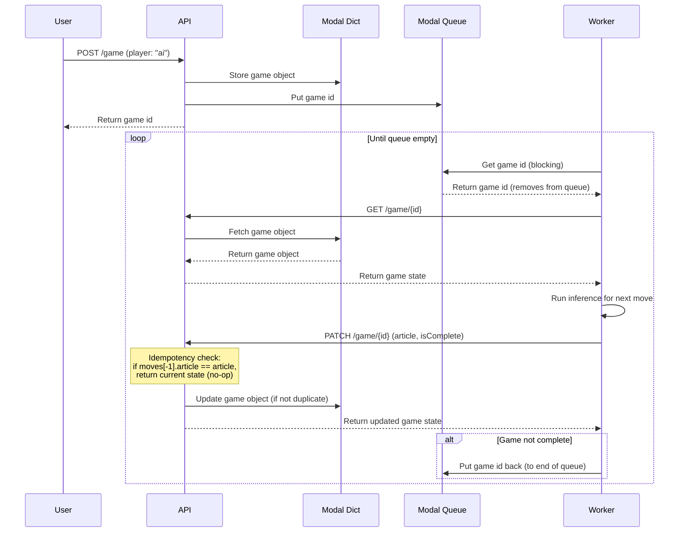

# API Design

## Lifecycle

### Create Game
```
POST /game

Request:
{
  player: "human" | "ai"
  startArticle: str
  endArticle: str
}

Response:
{
  id: uuidv4
}
```

### Get Game State
```
GET /game/{id}

Response:
{
  id: uuidv4
  startArticle: string
  endArticle: string
  moves: [
    {
      article: string
      timestamp: ISO8601
    }
  ]
  currentArticle: string
  isComplete: boolean
}
```

### Update Game State
```
POST /game/{id}

Request:
{
  article: string
}

Response:
{
  id: uuidv4
  startArticle: string
  endArticle: string
  moves: [
    {
      article: string
      timestamp: ISO8601
    }
  ]
  currentArticle: string
  isComplete: boolean
}
```

## AI Player Flow



### Reliability Strategy

- **Simple queue operations**: Just get/put, no partitions needed
- **Idempotent PATCH**: API checks if the last move's article matches the incoming article
  - If match: return current state without modification (no-op)
  - If different: add new move with timestamp
- **Worker crash handling**: If worker crashes after get(), the queue timeout returns the game ID to queue automatically
- **No orphaned games**: Duplicate processing is safe due to idempotency
